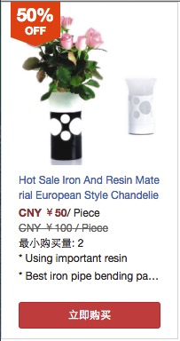

### 部件预览效果


### 部件说明
这是一个活动页面用到的以卡片形式展示商品信息的部件

### 如何使用
``` html
<PromotionProductCardA
     lang="zh_CN",
     productName="Hot Sale Iron And Resin Material European Style Chandelier with LED Bulbs",
     productUrl="http://www.globalmarket.com/order/lighting/product-info/hot-sale-iron-and-resin-material-european-style-chandelier-with-led-bulbs/5788499.html?tag=discounts&amp;origPrice=316.00&amp;percent=50&amp;pid=5788499",
     productImg="http://img01.globalmarket.com/scale/group1/M00/7D/FE/rBAAaFZr2ZeAd_nQAAEe8YXlp7o375_b_168x168.png",
     beforeDiscountPrice=100.00,
     afterDiscountPrice =50.00,
     moq=2,
     unit="Piece",
     sellingPoints={[
         "Using important resin",
         "Best iron pipe bending painted by lacquer"
     ]},
     currency="CNY"
 />
```